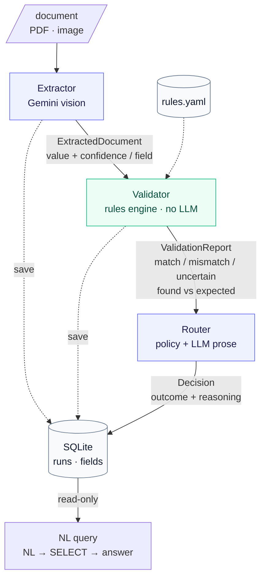

# Multi-Agent Trade Document Pipeline (POC)

Three agents do the boring 80% of trade-doc processing — **extract → validate → decide** —
and escalate only exceptions to a human.

- **Extractor** (Gemini vision) → structured fields, each with a confidence score.
- **Validator** (deterministic rules engine) → field-by-field `match / mismatch / uncertain`.
- **Router** (policy + LLM reasoning) → `auto-approve / human-review / amendment`, with an explanation.

Verified runs land in SQLite and are queryable in plain English.

## Quickstart

```bash
uv sync
cp .env.example .env          # add your GEMINI_API_KEY
uv run python scripts/generate_samples.py
uv run streamlit run app/ui_streamlit.py
```

## Layout

```
src/        config, schemas, gemini client, agents/, orchestrator, storage, nl_query
app/        streamlit UI
rules/      customer rule sets (yaml)
scripts/    sample document generator
tests/      validator + nl_query tests (run without an API key)
```

## Pipeline



## Design rationale

**Why three agents, not one prompt.** The work has three genuinely different shapes —
perception, rule comparison, and policy — with different correctness criteria and different
right tools. Splitting them lets each be unit-tested in isolation, retried independently, and
audited step-by-step. One mega-prompt couldn't be tested or partially recovered; five would be
ceremony for a linear flow. The boundary maps cleanly to **executor (Extractor) → verifier
(Validator) → planner (Router)**.

**LLM only where it earns its place.**
- *Extractor* uses a vision LLM (Gemini) — perception genuinely needs it. `temperature=0` and a
  schema-constrained response keep it deterministic in shape.
- *Validator* is a **deterministic rules engine** — comparing "found vs expected" must be
  reproducible; an LLM here would add nondeterminism and hallucination risk for no gain.
- *Router* decides the outcome with a **deterministic policy** (auditable) and uses the LLM only
  to write the human explanation and amendment draft, grounded on facts computed in code.

**Model choice.** `gemini-3.1-flash-lite` for every agent — vision, native PDF, structured
output, and text, at the lowest cost/latency tier. One model keeps the POC simple and the cost
profile flat. Orchestration is a small custom pipeline, not LangGraph: three linear steps don't
justify the dependency, and explicit typed handoffs + SQLite checkpoints are simpler to reason about.

**Trust & failure handling.**
- *No hallucinated fields* — the extractor is instructed to emit `null` / confidence `0` for
  anything not visibly present, and confidence is a required part of every field.
- *No silent approval* — a missing value or a sub-threshold confidence (`confidence_threshold`
  in `src/config.py`, default 0.7) is forced to `uncertain` before any rule runs.
- *No runaway* — the pipeline is a finite chain with zero retry loops; each LLM call is one shot.
- *Crash safety* — state is committed after every step; a crash leaves the run at its last good
  status (`extracted` / `validated`) for inspection. Writes are idempotent per `run_id`.
- *Safe NL queries* — generated SQL must pass a SELECT-only guard **and** runs on a read-only
  connection; answers are summarised strictly from the returned rows.

## Testing

```bash
uv run pytest          # validator + NL-guard tests, no API key required
```

