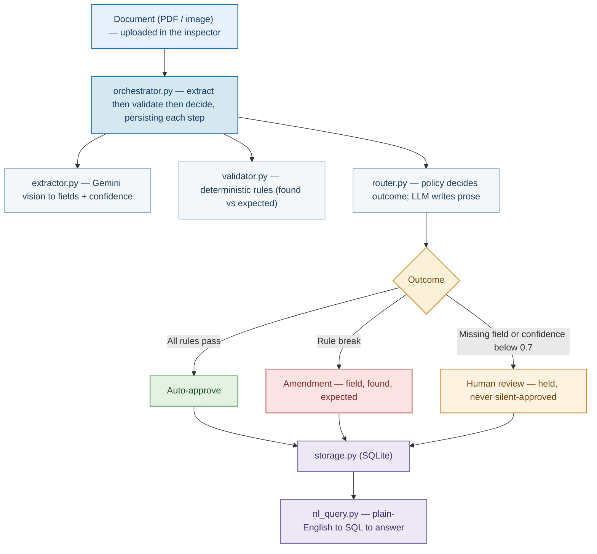
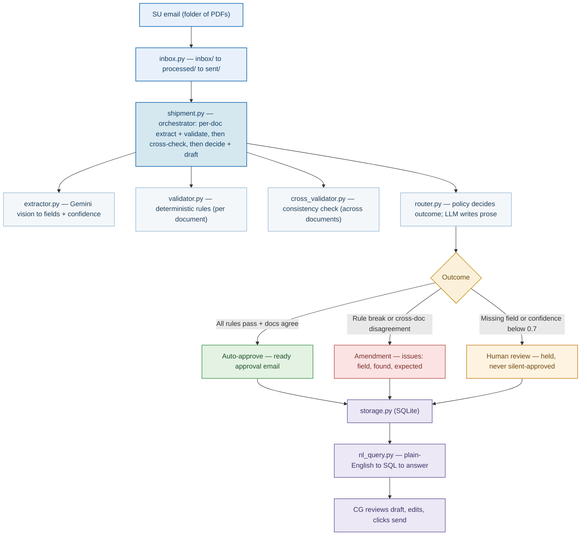

# Multi-Agent Trade Document Pipeline (POC)

Three agents do the boring 80% of trade-doc processing — **extract → validate → decide** — and
escalate only exceptions to a human.

- **Extractor** (Gemini vision) → structured fields, each with a confidence score.
- **Validator** (deterministic rules engine) → field-by-field `match / mismatch / uncertain`.
- **Router** (deterministic policy + LLM prose) → `auto-approve / human-review / amendment`, explained.

## Setup

```bash
uv sync                              # or: pip install -e ".[dev]"
cp .env.example .env                 # add your GEMINI_API_KEY (Google AI Studio)
uv run python scripts/generate_samples.py
```

`uv run <cmd>` runs inside the project venv. Without uv: activate the venv and drop the prefix.

## Part 1 — Single-document inspector

Upload one trade document; see every extracted field with its confidence, the rule check
(found vs expected), the decision with reasoning, and ask questions over stored runs in plain English.

```bash
uv run streamlit run app/ui_streamlit.py
```



## Part 2 — CG inbox agent

The same agents wired to the real CG workflow. A supplier (SU) emails shipment documents; the agent
wakes on arrival, reads **every** attachment, validates each against the **customer's** rules,
**cross-checks shared fields across documents** (consignee, HS code, …), and hands CG a verification
result + an **editable draft reply**. The agent never sends — CG reviews and clicks send.

```bash
uv run streamlit run app/cg_console.py     # CG console: receive → review → send
uv run python scripts/watch_inbox.py       # optional: the standalone inbox watcher (the real trigger)
```

**Demo:** in the sidebar SU outbox, pick a prepared shipment and click **Send to CG**. The live
monitor detects the new mail, analyzes it stage by stage, and opens it: email + downloadable
attachments, the decision, per-doc verification, cross-document consistency, discrepancy detail with
source snippets, and the draft reply. Prepared shipments exercise clean approvals and amendment
requests across two customers (ACME and Globex), each validated against its own rule set.




## Layout

```
src/         config, schemas, gemini client, storage, nl_query
src/agents/  extractor, validator, cross_validator, router
src/         inbox (mock email plumbing), shipment (multi-doc orchestrator)
app/         ui_streamlit (Part 1), cg_console (Part 2)
rules/       per-customer rule sets (yaml)
scripts/     sample generator, inbox watcher
tests/       deterministic unit tests (no API key needed)
```

## Design decisions

- **Three agents, not one prompt.** Perception, rule comparison, and policy have different
  correctness criteria and different right tools — splitting them lets each be tested, retried, and
  audited in isolation.
- **LLM only where it earns it.** Vision extraction needs an LLM (`temperature=0`, schema-constrained).
  Validation and cross-checks are deterministic Python — "found vs expected" must be reproducible.
  The Router *decides* with an auditable policy and uses the LLM only to write prose, grounded on
  facts computed in code so it can't invent a field.
- **Trust & failure.** No silent approvals — a missing value or confidence `< 0.7` is forced to
  `uncertain`. The agent drafts but never sends (sending is a separate human action writing to
  `sent/`). State is committed per step; a crash leaves the run at its last good status. NL→SQL is
  SELECT-only on a read-only connection.
- **Per-customer rules.** Each customer maps to its own `rules/<customer>.yaml`; adding a customer is
  a YAML file, not a code change. The engine is fixed; the rules vary.
- **The trigger is the missing piece, not the model.** Part 2 simulates the mailbox with a watched
  folder (`inbox/` → `processed/` → `sent/`). Swapping in a real IMAP poll or inbound webhook is a
  change to `src/inbox.py` only — the pipeline downstream is unchanged.

## Testing

```bash
uv run pytest          # deterministic agent + NL-guard tests, no API key required
```
